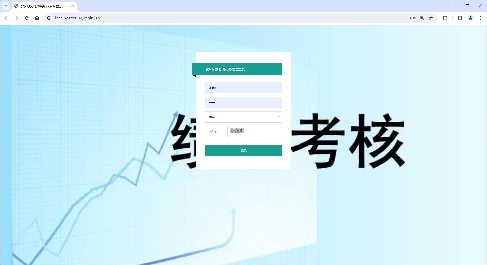
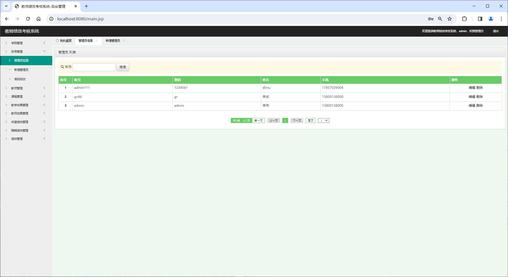
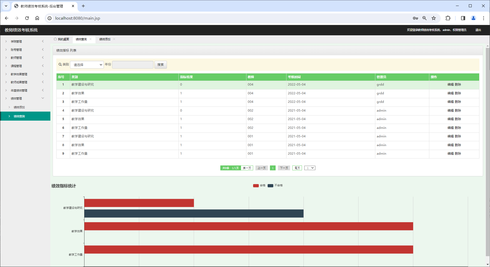
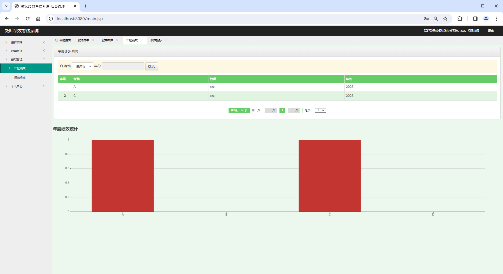
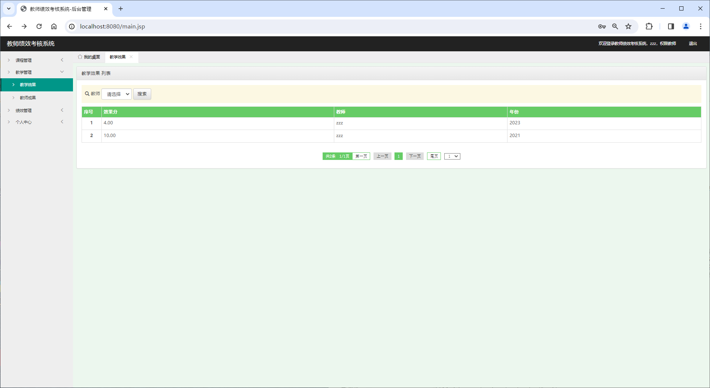
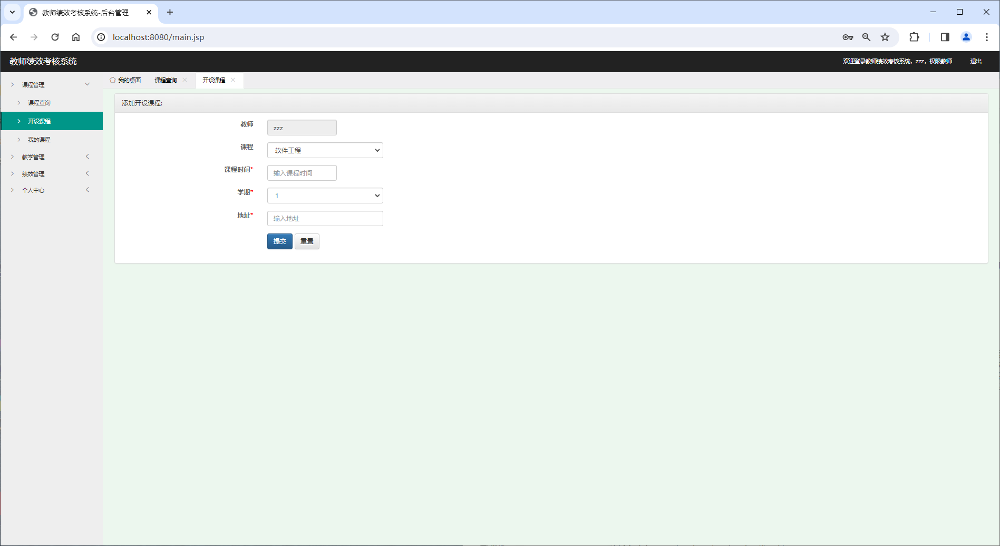
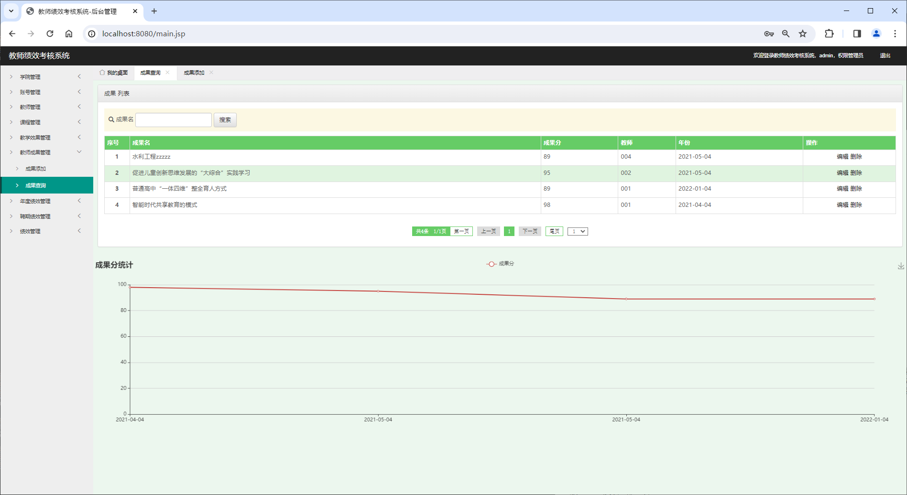

<h1 align="center">基于SSM框架的高校教师绩效管理系统</h1>

 获取sql文件 QQ: 605739993 QQ群: 377586148 

 [个人站点: 从戎源码网](https://armycodes.com/)

## 简介

> 本代码来源于网络,仅供学习参考使用!
>
> 提供1.远程部署/2.修改代码/3.设计文档指导/4.框架代码讲解等服务
>
> 前端地址：http://localhost:8080/login.jsp
>
> 管理员: admin 密码: 123456
>
> 用户：001 密码: 123456
>

## 项目介绍

基于SSM框架的高校教师绩效管理系统：前端 JSP、LayUI、BootStrap、JQuery、Ajax，后端 maven、springmvc、mybatis；角色分为管理员和老师。管理员添加学院、管理员、教师信息，也可以对教师成果进行管理、对年度绩效进行评定等；老师按课程信息进行管理、对教学内容进行添加、查看绩效指标等。主要功能如下：

### 启动方式

- 前端：
> 启动Tomcat

- 后端：
> 按钮启动 | 启动Tomcat

### 管理员：

- 基本操作：登录、修改密码
- 学院管理：获取学院列表、搜索学院、添加学院信息、修改学院信息、删除学院
- 账号管理：获取管理员列表、搜索管理员、添加管理员信息、修改管理员信息、删除管理员
- 教师管理：获取教师列表、筛选教师、搜素教师、添加教师信息、修改教师信息、删除教师
- 课程管理：获取课程列表、搜索课程、修改课程信息、添加课程信息、删除课程、获取开设课程列表、搜索开设课程、筛选开设课程、修改开设课程信息、删除开设课程
- 教学效果管理：获取教学效果列表、筛选教学效果、添加教学效果信息、修改教学效果信息、删除教学效果
- 教师成果管理：获取教师成果列表、搜索教师成果、添加教师成果信息、修改教师成果信息、删除教师成果
- 年度绩效管理：获取年度绩效列表、筛选年度绩效、添加年度绩效信息、修改年度绩效信息、删除年度绩效
- 绩效管理：获取绩效列表、筛选绩效、添加绩效信息、修改绩效信息、删除绩效

### 老师：

- 基本操作：登录、修改密码、获取个人信息、修改个人信息
- 课程模块：获取课程列表、搜索课程、开设课程、获取我的课程列表、筛选我的课程、修改我的课程信息、删除我的课程
- 教学模块：获取我的教学效果列表、筛选我的教学效果、获取我的成果列表、搜索我的成果
- 绩效模块：获取我的年度绩效列表、筛选我的年度绩效、获取我的绩效指标列表、筛选我的绩效指标

## 环境

- <b>IntelliJ IDEA 2020.3</b>

- <b>Mysql 5.7.26</b>

- <b>Tomcat 9.0.41</b>

- <b>JDK 1.8</b>

## 运行截图

